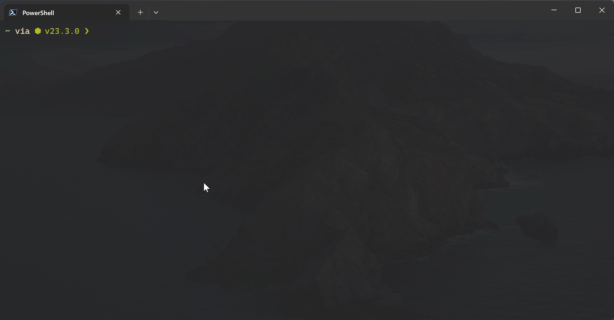

# Subsonic CLI

  

A basic CLI application to interact with Subsonic API compatible servers.

> [!NOTE]
> This program relies on FFplay (which is part of FFmpeg suite) to work properly. If not installed, unexpected program behavior may occur.

Install with `npm i -g subsonic-cli` and run with `scli`.
(alternatively, use `npx subsonic-cli`.)

Commands

- `scli help` - shows the help menu.

### Configuration

_all config data saved to ~/.scli-config.yml_

- `scli set-url <url>` - sets the server URL
- `scli set-credentials <username> <password>` - sets the server username/password

### Cache/Server operation

_cached songs saved to ~/.scli-cache/_

- `scli clear` - empties cache
- `scli ping` - test connection to server
- `scli play (s)ong <query>` - Searches for songs matching the given query - if there are multiple results, opens a navigation menu. Plays the song with FFplay.
- `scli play (a)lbum <query>` - Searches for albums matching the given query - if there are multiple results, opens a navigation menu. Plays the album with FFplay.
- `scli play (p)laylist <query>` - Searches for playlists matching the given query - if there are multiple results, opens a navigation menu. Plays the playlist with FFplay.
